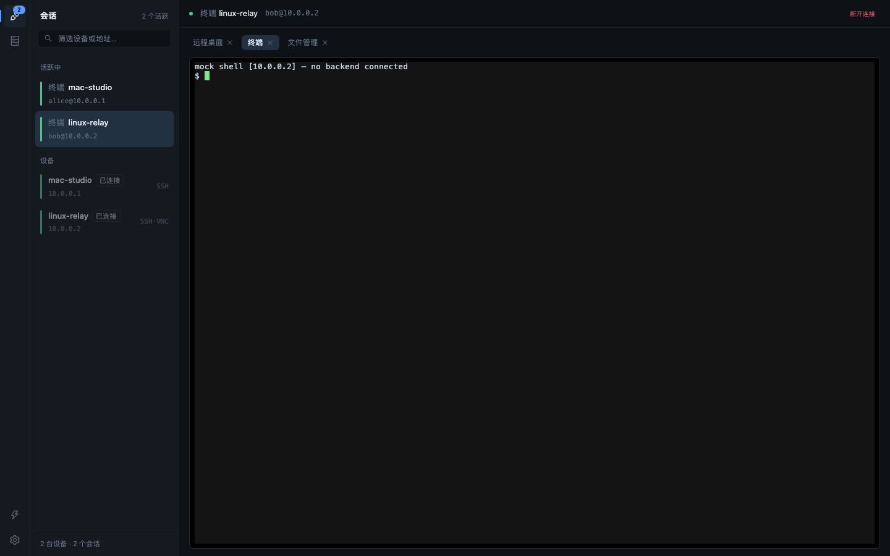
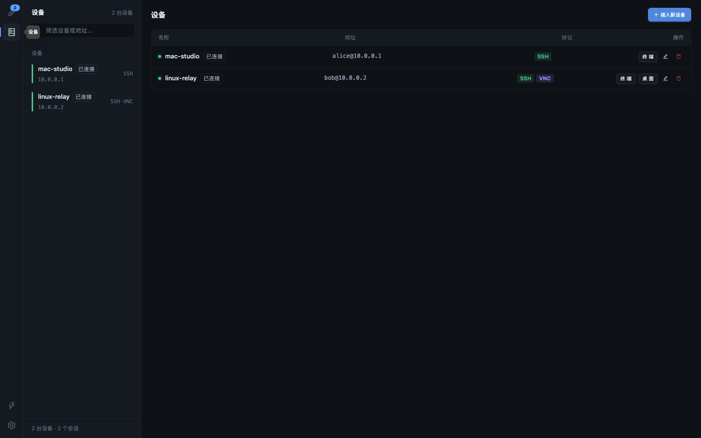

# DeskMux

[](https://github.com/terayang/DeskMux/actions/workflows/ci.yml)
[](https://github.com/terayang/DeskMux/releases)
[](LICENSE)
[](https://github.com/terayang/DeskMux/releases)
[](go.mod)

[English](README.md) | **简体中文** | [Releases](https://github.com/terayang/DeskMux/releases) | [Issues](https://github.com/terayang/DeskMux/issues) | [Contributing](CONTRIBUTING.md)

---

DeskMux 是一个跨平台（macOS / Windows）桌面远程会话管理器：输入目标 IP，自动探测其可用的远程协议（SSH / VNC / RDP / Telnet / FTP / SMB / HTTP(S)），多选后一键建立远程桌面、SSH 终端与 SFTP 文件管理会话。体验对标 1Remote / Tabby / Termius。

> 合规提示：DeskMux 是远程管理工具，请仅在你拥有或被明确授权的设备上使用。开发者不对任何滥用行为负责。

### 截图





### 功能

- **Operator Console 工作台**：48px 活动栏 + 上下文理表 + 主内容区三栏布局——会话视图（活跃会话 + 已保存设备，实时筛选）与设备舰队视图（行内 [终端]/[桌面] 协议直连入口）
- **⌘K 命令面板**：地址秒连、搜索已存设备与活跃会话、切换会话（⌘1…⌘9 直达第 N 个），全面键盘优先
- **协议自动探测**：对目标 IP 并发探测常见端口 + 协议指纹识别，以卡片形式展示，每张卡片附一句通俗说明，支持多选
- **VNC 远程桌面**：noVNC 渲染 + Go 侧智能桥接，支持 macOS Screen Sharing（Apple DH 认证）与标准 VNC 密码认证；双向剪贴板同步（RFB 协议限制仅 Latin-1）、全屏、只读模式、发送特殊按键（Ctrl+Alt+Del / Alt+F4 / Super）；缩放、光标、编码 / 色深 / 画质 / 压缩均可调
- **SSH 终端**：xterm.js + Go SSH/SFTP 会话管理，支持密码与私钥认证；TCP + SSH 应用层双层 keepalive，连续失败自动判定断线
- **SFTP 文件管理**：远程文件浏览、上传 / 下载、新建 / 删除 / 重命名
- **连接管理**：保存主机配置并可一键重连；保存后可编辑名称 / 主机 / 用户名 / 协议 / 凭据——打开编辑器时自动探测主机协议，新检测到已开放的协议可一键添加；密码 / 私钥默认存系统钥匙串（macOS Keychain / Windows Credential Manager），可在设置中改为本机加密文件（AES-256-GCM，密钥由机器硬件 UUID 派生）
- **多会话并存**：同一 / 不同目标的多个会话并存，各有独立协议标签页（桌面 / 终端 / 文件）；切换时终端缓冲、文件管理与桌面画面、连接全部保留
- **国际化**：界面默认简体中文，内置英文（en-US）

> RDP / Telnet / FTP / SMB / HTTP(S) 当前仅探测展示，实际连接见 Roadmap。

### 下载与安装

从 [GitHub Releases](https://github.com/terayang/DeskMux/releases) 下载最新版本：

- **macOS**：`DeskMux-<version>-mac-arm64.dmg`（Apple Silicon）或 `DeskMux-<version>-mac-x64.dmg`（Intel）
- **Windows**：`DeskMux-<version>-windows-x64-installer.exe`（NSIS 安装包，当前用户安装）或 `DeskMux-<version>-windows-x64-portable.exe`（免安装便携版）

开发版（每次 push 到 main 或 PR 的 CI 构建）在对应 [workflow run 页面](https://github.com/terayang/DeskMux/actions/workflows/ci.yml)底部 artifacts 下载。

**安装包未做代码签名**，首次启动会被系统安全机制拦截，属正常现象：

- **macOS**：右键（Control+点击）`DeskMux.app` →「打开」→ 再次确认「打开」
- **Windows**：SmartScreen 蓝色提示中点「更多信息」→「仍要运行」

详细指引见 [docs/RELEASE.md](docs/RELEASE.md)。

### 本地构建安装包

```bash
npm install && npm --prefix frontend install
npm run dist       # macOS：分别构建 arm64 与 x64 → dist/DeskMux-<version>-mac-arm64.dmg 与 -mac-x64.dmg
npm run dist:win   # Windows：安装包 + 便携版（带版本号）→ build/bin/
```

两个打包命令都会先自动递增 patch 版本号（`scripts/bump-version.mjs`），保证每次构建的产物文件名唯一、互不覆盖。

### 常见问题

- **首次保存连接时弹出钥匙串授权？** 密码 / 私钥默认存系统钥匙串，macOS 首次写入需要授权一次；点「允许」即可。也可在设置（左侧活动栏底部齿轮）改为「本地文件」存储（AES-256-GCM 加密，换机器无法解密，但安全性低于钥匙串）。
- **VNC 鼠标不显示？** Apple 的 Screen Sharing 不稳定下发光标形状，默认使用「本地光标」（工具条可切换「远程光标」）。若偶发不可见，切换一次光标模式即可。
- **剪贴板同步对中文无效？** RFB 协议的剪贴板消息（CutText）仅支持 Latin-1 字符集，macOS Screen Sharing 又未实现任何扩展剪贴板编码，因此中文等非 Latin-1 字符无法经 VNC 剪贴板传输——这是协议限制，不是缺陷。
- **远程桌面卡顿 / 模糊？** 打开工具条齿轮「画面设置」：推荐 编码 **ZRLE** + 色深 **16 位** + 压缩 **省带宽**；文字清晰度优先时缩放选「原始尺寸」。
- **能连哪些协议？** SSH 终端、SFTP 文件管理、VNC 桌面（含 macOS Apple DH 认证）；RDP / Telnet / FTP 目前仅探测展示，见 Roadmap。

### 开发

前置：Go 1.26、Node.js 22+、wails CLI v2.13（`go install github.com/wailsapp/wails/v2/cmd/wails@v2.13.0`，确保 `~/go/bin` 在 PATH）。

```bash
npm install && npm --prefix frontend install   # 安装依赖
npm run dev        # wails dev（HMR；纯前端预览可 npm --prefix frontend run dev，bridge 自动切 mock）
npm test           # Go 测试（go test ./...）
npm run typecheck  # go vet ./... + 前端 tsc --noEmit
npm run build      # wails build → build/bin/（同时重新生成 frontend/wailsjs/ 绑定）
```

参与贡献请阅读 [CONTRIBUTING.md](CONTRIBUTING.md)；安全问题请见 [SECURITY.md](SECURITY.md)；版本历史见 [CHANGELOG.md](CHANGELOG.md) 与 [Releases](https://github.com/terayang/DeskMux/releases)。

### 技术架构

Wails v2（Go 后端 + 系统 WebView 渲染），2026-07 由 Electron 迁移而来（动机与实测数据见 [docs/MIGRATION.md](docs/MIGRATION.md)：dmg 133MB→11MB、启动 340ms→241ms）。Go 单进程承载全部网络与协议层——协议指纹扫描器（`internal/scanner`）、带 keepalive 的 SSH/SFTP 会话（`internal/sshx`）、RFB 握手与 Apple DH 认证（`internal/rfb`）、WS↔TCP VNC 桥接（`internal/vncbridge`）、连接存储与凭据保管（`internal/store`，系统钥匙串或本地加密文件可选）；前端 React 18 + antd v5 + zustand + i18next 经 `frontend/src/bridge/` 的 `window.deskmux` 适配层调用 Wails 绑定，远程桌面用 noVNC、终端用 xterm.js。完整选型理由与模块结构见 [docs/ARCHITECTURE.md](docs/ARCHITECTURE.md)，打包发布见 [docs/RELEASE.md](docs/RELEASE.md)。

### Roadmap

- RDP / Telnet / FTP 实际连接（当前仅探测展示）
- SMB / HTTP(S) 的深度集成
- 更多界面语言（当前简体中文 + 英文，i18n 框架可扩展）

### 目录结构

```
deskmux/
├─ main.go / app.go / bindings.go   # Wails 入口、应用门面、绑定与桥接错误约定
├─ internal/                        # Go 服务层
│  ├─ scanner/                      # 协议探测（端口扫描 + 指纹识别）
│  ├─ sshx/                         # SSH/SFTP 会话管理 + keepalive
│  ├─ rfb/                          # RFB 握手、security type 2/30 认证
│  ├─ vncbridge/                    # WS↔TCP VNC 桥接
│  └─ store/                        # 连接存储、系统钥匙串 / 本地加密凭据保管
├─ frontend/
│  ├─ src/                          # React UI（pages / components / hooks / utils / store / i18n / bridge）
│  └─ shared/                       # 前后端共享类型与协议常量
├─ scripts/                         # build-dmg.sh / bump-version.mjs / measure-startup.sh / mockvnc（VNC 测试服务器）
├─ build/                           # appicon.png、darwin/windows 模板、构建输出（build/bin/，不入库）
├─ docs/                            # 架构、迁移、发布与设计文档
└─ .github/                         # CI / Release 工作流、Issue 与 PR 模板
```

### License

[MIT](LICENSE) © 2026 Silica Yang
